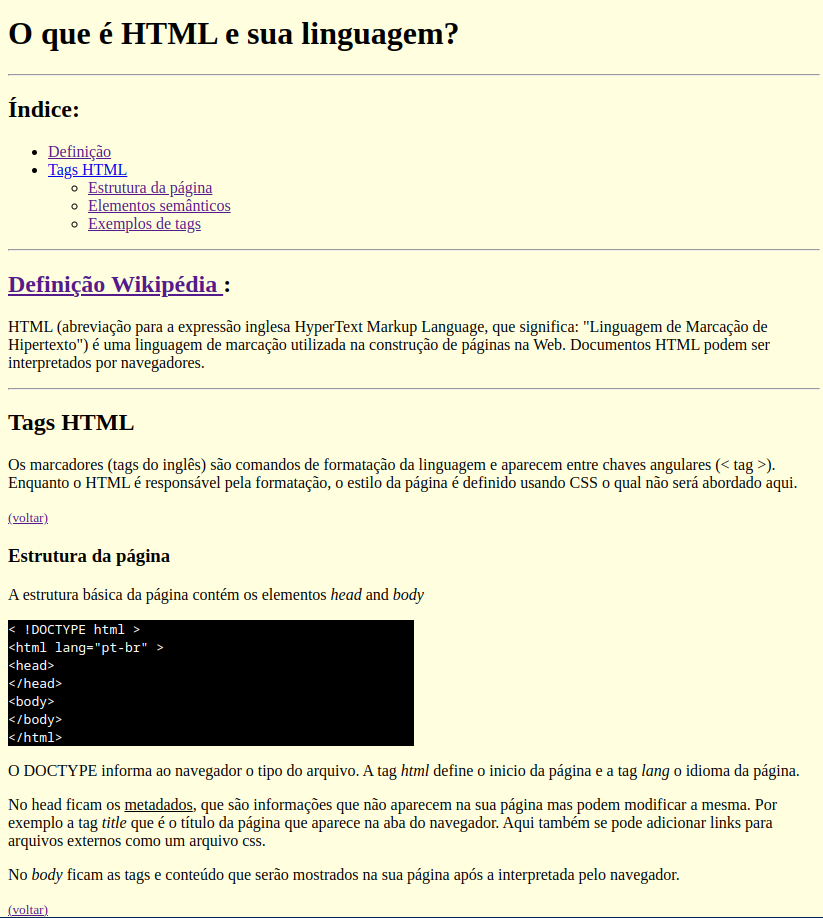

<h1>
    
    Formação HTML Web Developer
</h1>

# :computer: Criar Uma Página Web Utilizando as Tags Aprendidas

A ideia deste Desafio de Projeto é elaborar um website, utilizando uma estrutura bem básica, utilizando tags aprendidas durante as aulas práticas:
 
* Utilizar todas as tags explicadas nas aulas: \<h1> até \<h6>, \
, \<mark>, \<small>, \<i>, \<u>, \<strong>, \<ol>, \<ul>, \<li>, \<a>, \
, \, \, \<blockquote>;

* Utilizar novas tags sugeridas: \, \<del>, \
, \<abbr> (a ideia é buscar estas tags na internet, entender como ela funciona e utilizar no texto).

# :bulb: Solução do desafio

Desenvolvimento de uma página html5 para familiarização com as tags. A página está no arquivo index.html.

Preview:

